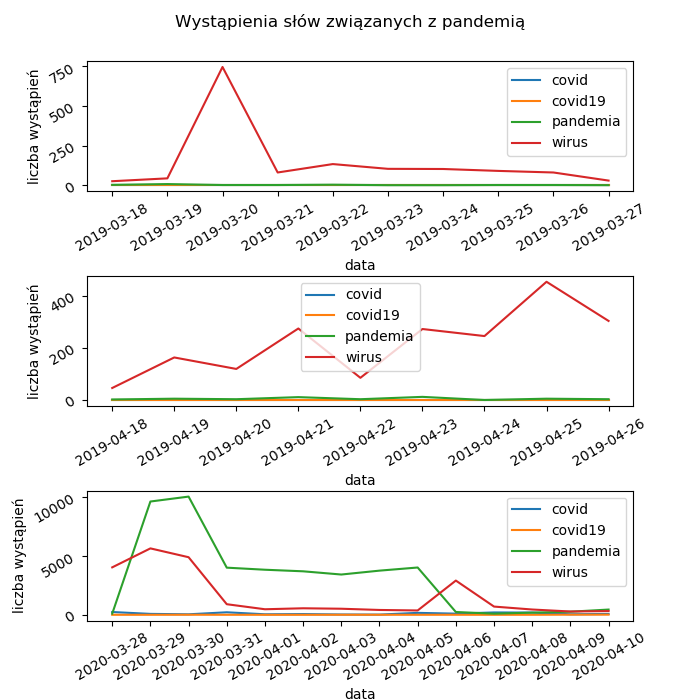

# Sprawozdanie z projektu z ASEiED 2020
Paweł Łogin 171797
Marcin Wankiewicz 172118
Jędrzej Czapiewski 171747
## Temat zadania
Nasze zadanie polegało na przeanalizowaniu danych pochodzących z różnych stron internetowych w przedziałach czasu marzec/kwiecień 2019 oraz marzec/kwiecień 2020 pod kątem liczby wystąpień słów "wirus", "covid19", "covid", "pandemia". Zmiana częstotliwości występowania tychże słów została ukazana przez nas na odpowiednich wykresach w skali dniowej. Mieliśmy również dokonać analizy tematycznej wykorzystanych stron przy użyciu metadanych.
## Połączenie ze środowiskiem AWS
Na starcie projektu próbowaliśmy początkowo rozwiązywać zagadnienie na lokalnym komputerze w środowisku Python. Szybko doszliśmy jednak do wniosku, że dostęp do danych z commoncrawla z naszych komputerów nie jest bezpośrednio możliwy, a przetworzenie ich byłoby bardzo czasochłonne. Po dojściu do tych wniosków stworzyliśmy w konsoli AWS klaster, z którym połączyliśmy się dzięki stworzeniu klucza SSH, przypisaniu go do klastra i wprowadzeniu do programu putty. Następnie stworzyliśmy w konsoli AWS Bucket na S3 i umieściliśmy w nim nasz pierwszy pythonowy skrypt. Skrypt ten uruchomiliśmy na utworzonym przez nas klastrze. Niestety napotkaliśmy wiele problemów odnośnie dostępności używanych przez nas bibliotek i po poszukiwaniach udało nam się lokalnie zainstalować wymagane biblioteki na głównej instancji klastra. Przetwarzanie danych na takim klastrze zajmowało jednak zbyt długo czasu i zaczęliśmy pracować na większym klastrze, posiadającym aż 6 instancji pomocniczych. Podczas pierwszej próby uruchomienia naszego programu na takim klastrze okazało się, że instalowane przez nas biblioteki znajdują się tylko na instancji głównej, a reszta wątków wykonujących program miała problem z dostępem do nich. Wtedy zmieniliśmy podejście do tworzenia klastrów i zamiast uruchamiać je z konsoli AWS robiliśmy to wpisując odpowiednią komendę na naszym mniejszym klastrze instalując przy tym odpowiednie biblioteki zapisane w pliku .sh. Tak zbootstappowany klaster był wystarczająco duży i wyposażony we wszystkie potrzebne nam biblioteki.

Udało nam się przeanalizować około 5 milionów stron. Wynik analizy przedstawiony jest w postaci wykresów na końcu tego sprawozdania.
## Program
### Na początku programu wskazujemy wyjściowy dla naszych danych bucket, oraz tworzymy klucze słowne, według których będziemy przeszukiwali strony na commoncrawlu.
### Następnie inicjalizujemy sparka oraz wczytujemy wszystkie dane z bucketu s3 commoncrawla.
### W kolejnym kroku tworzymy zapytanie SQLowskie, aby wybrać ze wszystkich danych tylko te, które nas interesują. W naszym konkretnym przypadku są to polskie strony w formacie WARC z okresów marzec/kwiecień 2019 oraz marzec/kwiecień 2020. Po stworzeniu odpowiedniego zapytania konstruujemy data frame.
### W następnym kroku odczytujemy i przetwarzamy znalezione pliki WARC. Dzięki bibliotece boto3 łączymy się z klientem s3 oraz pojedynczo przetwarzamy każdą stronę. Stronę w postaci html parsujemy do stringa i sprawdzamy w niej wystąpienie wskazanych przez nas słów kluczy. Liczbę wystąpień każdego z słów zwracamy i zapisujemy w odpowiednich zmiennych.
### Następnie wyniki są parsowane i sortowane rosnąco według dat. Po odpowiednim posortowaniu wszystkie zliczenia umieszczane są w pliku csv i na podstawie tych plików rysowane są wykresy zmian liczby wystąpień danych słów w skali dniowej.

W marcu/kwietniu 2019 roku nikt jeszcze o pandemii nie słyszał - stąd znikome użycie szukanych słów w polskim internecie. Jedynym słowem które występowało w większej ilości było słowo wirus - które prawdopodobnie i tak użyte było w innym kontekście (wirus komputerowy lub po prostu inna choroba).
W roku 2020 widać znaczny skok w występowaniu szukanych słów. Wśród nich nadal przoduje wirus, lecz dołączyło do niego jeszcze słowo pandemia. Można zauważyć tendencję malejącą (zwłaszcza patrząc na "pandemię"), gdyż to chwilę przed badanym okresem nastąpiła największa panika odnośnie wirusa.